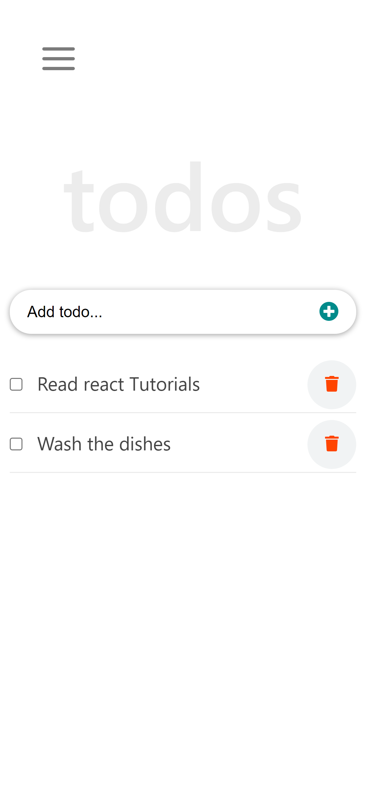
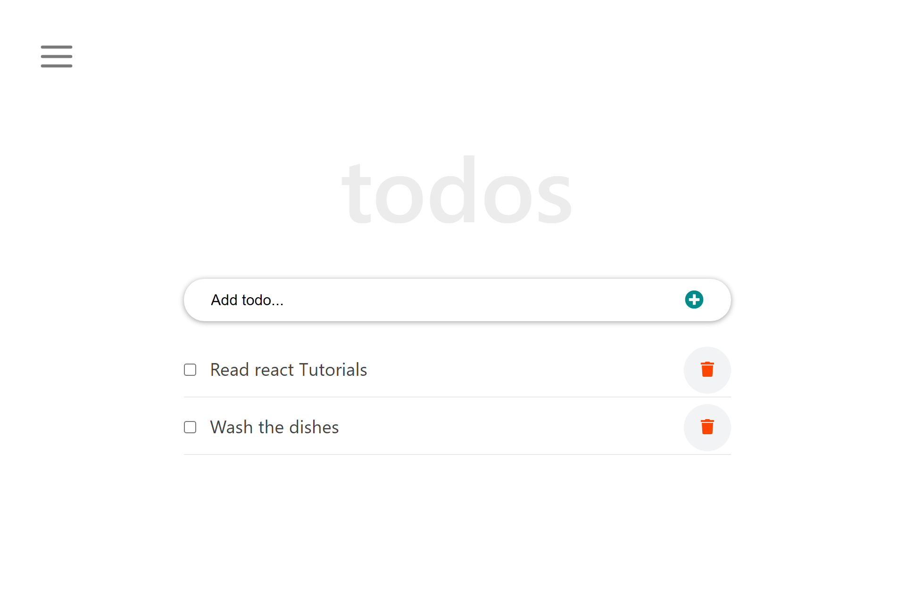

# React To-do App

This project was bootstrapped with [Create React App](https://github.com/facebook/create-react-app).

> The React To-do App is a **Single Page App** _(SPA)_ built mainly with `ReactjS`. It allows users to add tasks, delete tasks, edit tasks and navigate to different parts of the application without the browser reloading.

> |Mobile Version|Desktop Version
> |--------------|--------------|
> |.||

### `About The App`

- The Create-todos-React project is an App that helps the user organize his/her day by allowing the user do the following:

- Add a new task
  
- Delete tasks

- Mark a selected task as complete

- Edit tasks by double-clicking the task that the user wants edited
  
- Persist data in the browser's `localStorage`

- Use `SVG icons` in React
- Use `_life-cycle methods_`
- Use React `Hooks`
- Create Navigation Menu
- Deploy projects to `Github`

## Built With

- ### Major languages
  - Javascript, CSS, and HTML
- ### Frameworks
  - ReactJS
- ### Technologies used
  - Webpack, Babelrc, Linters

## Live Demo

[Live Demo Link](https://livedemo.com)


## Getting Started

To get a local copy up and running follow these simple example steps.

```
git clone https://github.com/Gambit142/Create-todos-React.git
```

and then run

```
npm i
npm start
```

## Installation

to build a production version to `bulid` folder run

```
npm run build
```

## Authors

:man::skin-tone-6: **Author1**

- GitHub: [@Gambit142](https://github.com/Gambit142)
- LinkedIn: [Francis Ugorji](www.linkedin.com/in/francis-ugorji-a567b7168)


## 🤝 Contributing

Contributions, issues, and feature requests are welcome!

Feel free to check the [issues page]([../../issues/](https://github.com/Gambit142/Create-todos-React/issues)).

## Show your support

Give a ⭐️ if you like this project!

## Acknowledgments

- Hat tip to Microverse for the opprotunity to learn ReactJS using their platform
- This App was built by implementing every step in [ibaslogic.com Tutorial Series](https://ibaslogic.com/react-tutorial-for-beginners/)

## 📝 License

This project is [MIT](./MIT.md) licensed.
